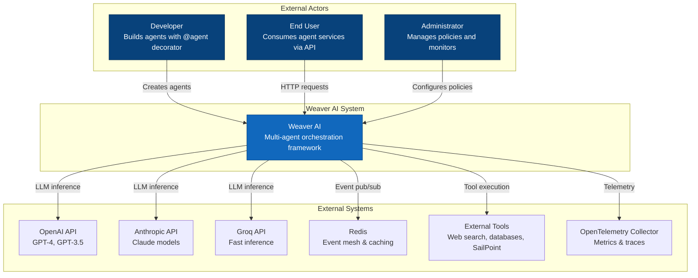
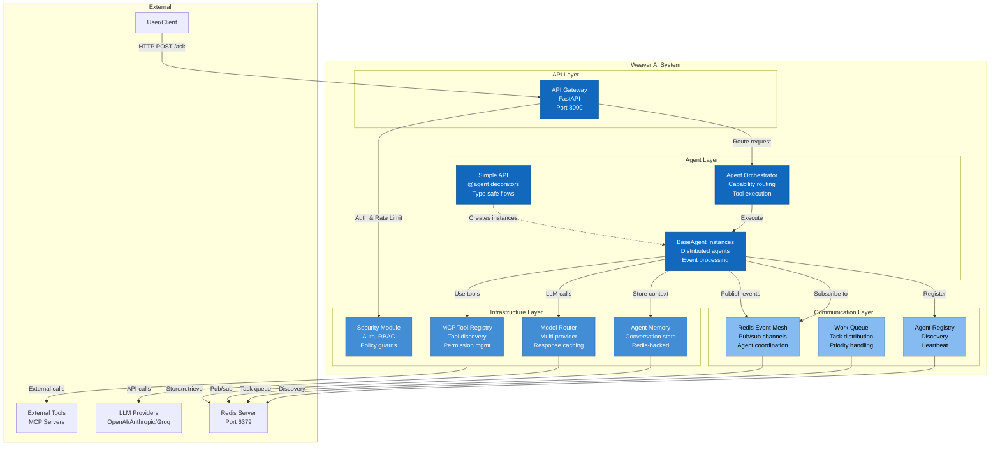
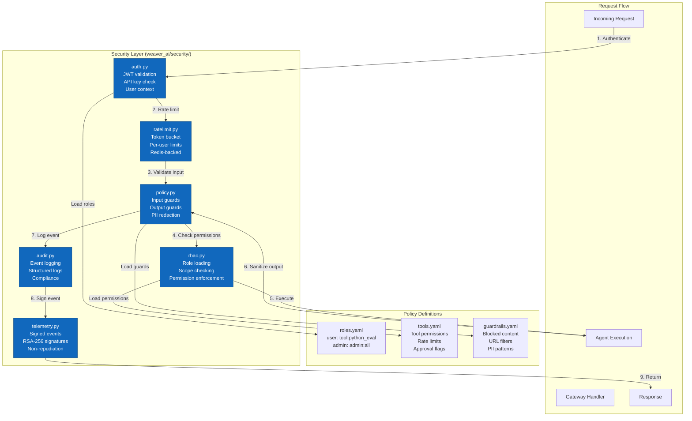
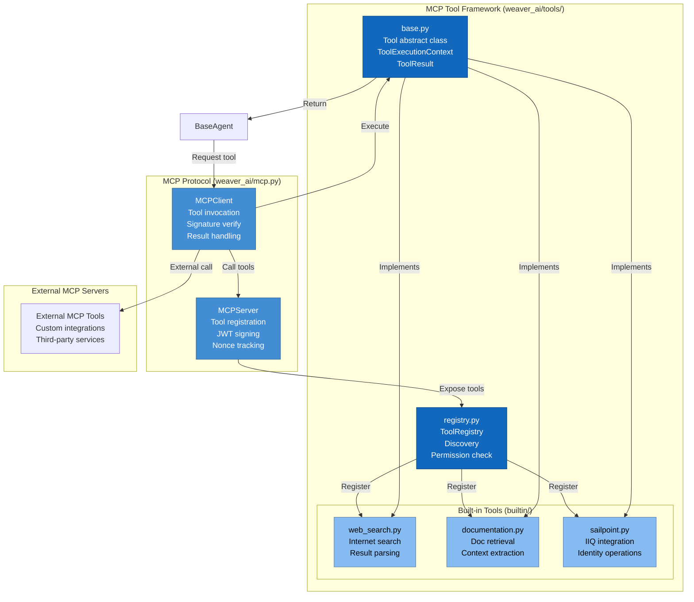
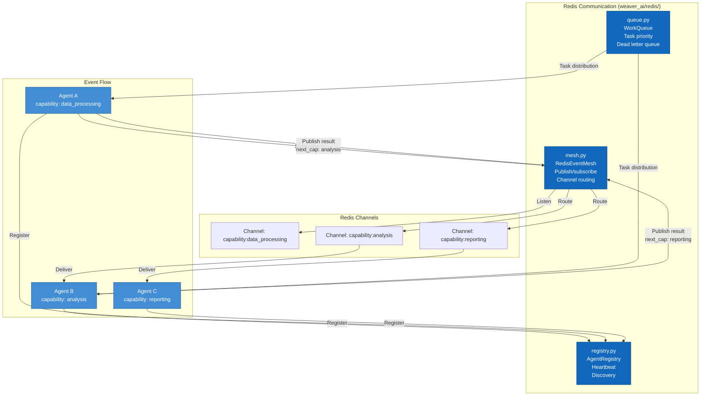
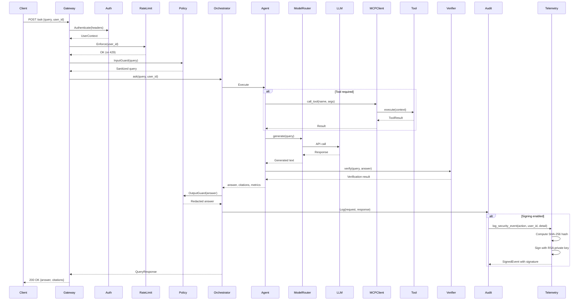
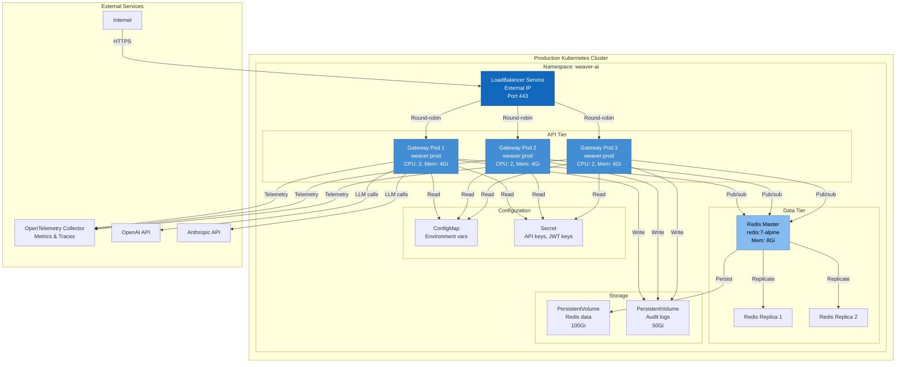

# C4 Model Diagrams - Weaver AI

This document contains C4 model diagrams for Weaver AI architecture using Mermaid notation.

## Level 1: System Context Diagram

Shows how Weaver AI fits into the broader ecosystem and its interactions with external systems.



## Level 2: Container Diagram

Shows the high-level containers (applications, services) that make up Weaver AI.



## Level 3: Component Diagram - Simple API

Detailed view of the Simple API layer components.

```mermaid
graph TB
    subgraph "Simple API (weaver_ai/simple/)"
        DECORATOR[decorators.py<br/>@agent decorator<br/>Type extraction<br/>Metadata attachment]
        FLOW[flow.py<br/>Flow builder<br/>Chain/Route/Parallel<br/>Type-based routing]
        RUNNERS[runners.py<br/>run() executor<br/>serve() HTTP server<br/>Async execution]
    end

    subgraph "Agent Framework (weaver_ai/agents/)"
        BASE[base.py<br/>BaseAgent class<br/>Capability matching<br/>Event processing]
        WRAPPER[SimpleAgentWrapper<br/>Function -> Agent<br/>Auto initialization<br/>Type routing]
    end

    subgraph "Core Infrastructure"
        ROUTER[ModelRouter<br/>LLM calls]
        MCPCLIENT[MCPClient<br/>Tool execution]
        EVENTMESH[RedisEventMesh<br/>Event distribution]
    end

    USER[Developer Code<br/>@agent decorated function] -->|Decorate| DECORATOR
    DECORATOR -->|Create metadata| WRAPPER
    DECORATOR -->|Extract types| FLOW

    USER -->|Build workflow| FLOW
    FLOW -->|Chain agents| WRAPPER

    USER -->|Execute| RUNNERS
    RUNNERS -->|Instantiate| WRAPPER
    WRAPPER -->|Inherits from| BASE

    BASE -->|LLM inference| ROUTER
    BASE -->|Tool calls| MCPCLIENT
    BASE -->|Publish/subscribe| EVENTMESH

    style DECORATOR fill:#1168bd,stroke:#0b4884,color:#ffffff
    style FLOW fill:#1168bd,stroke:#0b4884,color:#ffffff
    style RUNNERS fill:#1168bd,stroke:#0b4884,color:#ffffff
    style WRAPPER fill:#438dd5,stroke:#2e6295,color:#ffffff
    style BASE fill:#438dd5,stroke:#2e6295,color:#ffffff
```

## Level 3: Component Diagram - Security Architecture

Detailed view of security components and enforcement points.



## Level 3: Component Diagram - MCP Tools

Detailed view of MCP tool framework.



## Level 3: Component Diagram - Redis Event Mesh

Detailed view of distributed agent communication.



## Data Flow Diagram - HTTP Request

Shows the end-to-end data flow for an HTTP API request.



## Deployment Diagram

Shows the physical deployment architecture.



## Notes

- All diagrams use Mermaid syntax and can be rendered in GitHub, GitLab, or documentation tools
- For interactive editing, use [Mermaid Live Editor](https://mermaid.live/)
- Diagrams follow C4 model color conventions:
  - **Blue (#1168bd)**: Primary system containers
  - **Light Blue (#438dd5)**: Secondary containers
  - **Lightest Blue (#85bbf0)**: Supporting infrastructure
  - **Dark Blue (#08427b)**: External actors

## Diagram Maintenance

When updating these diagrams:

1. Keep consistent with actual code changes
2. Update version number in architecture README
3. Review with architecture team
4. Export PNG versions for presentations if needed
5. Ensure Mermaid syntax remains valid

## Recent Updates

**2025-10-05**: Added signed telemetry to security component diagram and HTTP request sequence diagram
- Added `telemetry.py` to Security Layer
- Added signing flow to HTTP request sequence
- Documents cryptographic signing for tamper-evident audit trails
